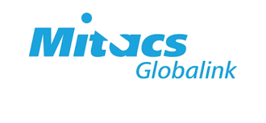

<h1 align="center"> 
<a> MITACS GRI INTERNSHIP</a> </h1>

<h2 align="center"> 
<a> Statistical data cleaning for Predictive modelling 
 </a> </h1>

Along with surplus amount of data tools and resources there is a broader scope for data explorations with unlimited insights and relationships hidden in the data. With the above mentioned possibilities to explore data this project work focuses on the statistical and the machine learning techniques applied on the real world data set.
With Statistics we can derive any relations with the variables and Machine Learning to make accurate predictions. Data cleaning has been a blooming field due to tremendous data with outliers, miscellaneous and weak relationships. Hence the work presents statistical techniques like Lasso and adaptive lasso for variable selection on real world data. The selected clean data is then fit to logistic regression machine learning algorithm to record better performance measure.

## Contact
Created by [Chiranthana R R](https://www.linkedin.com/in/chiranthana-r-r-232385200/) - feel free to contact me!
